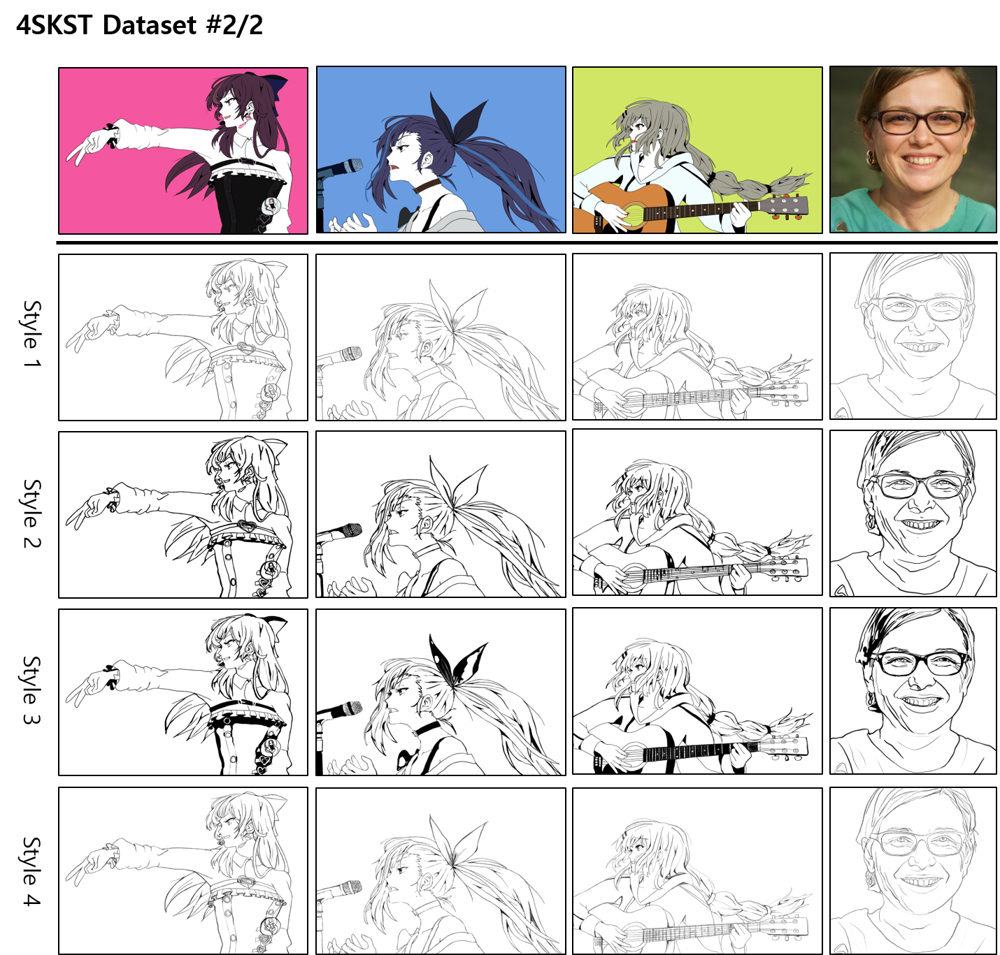

# 4skst_dataset
**This dataset can only be used for research purpose**

This repository is description of 4 sketch style (4SKST) dataset, from the research paper "Semi-supervised reference-based sketch extraction using a contrastive learning framework"

Dataset consists one of four different styles of sketches paired to color images.

Total 25 color images and corresponding 100 (25x4) sketches.

Sketches are drawn by professional artist.

Base color images are mainly from https://jewel-s.jp/ (Game source for free share), Flickr (CC-2.0), and generated by deep-learning model (StyleGAN, stablediffusion)

For more information of the dataset, please check supplementary material of original paper [[Link](https://drive.google.com/file/d/12WNxRFI7GrKrP1qdVDrcFPqvHubdbgUE/view?usp=share_link)]

You can download the dataset from this link [[Google Drive](https://drive.google.com/drive/folders/1cuOaW-gueemIxcrNh5vkZvmiYubh1rQD?usp=share_link)]

  
**Please cite this paper when you are using the dataset to your research.**
## Citation
    @article{Seo2023semi,
      title={Semi-supervised reference-based sketch extraction using a contrastive learning framework},    
      author={Chang Wook Seo, Amirsaman Ashtari, Junyong Noh},    
      journal={ACM Trans. Graph.},    
      volume={42},    
      number={4},    
      pages={1--12},    
      doi={10.1145/3592392},    
      year={2023}    
    }

